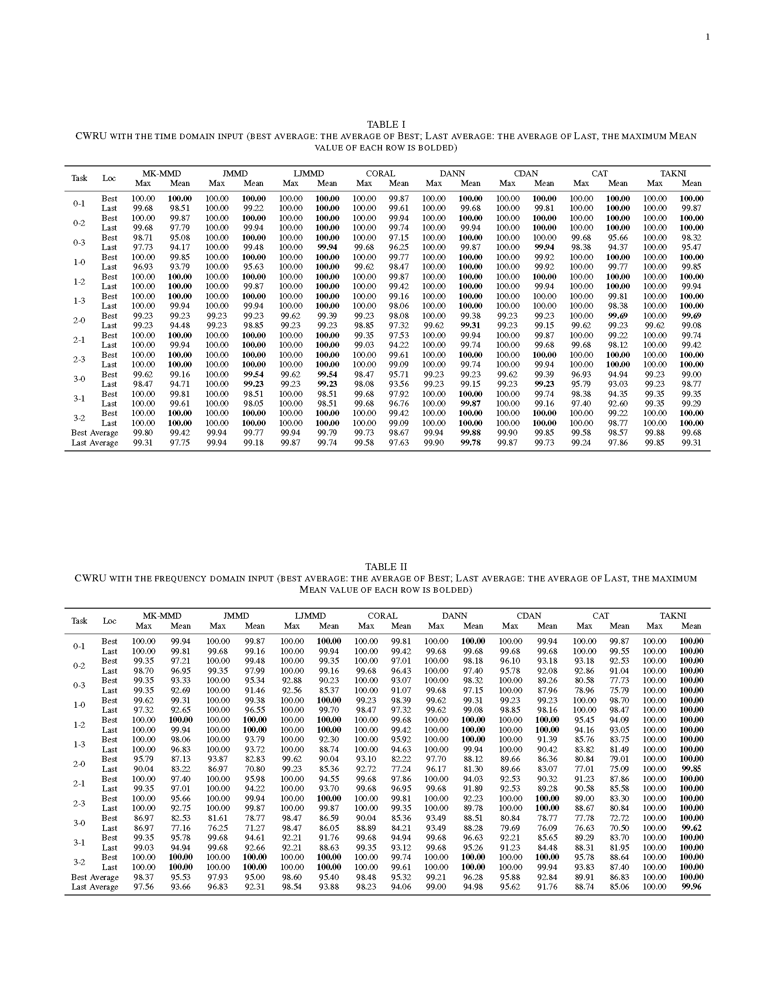
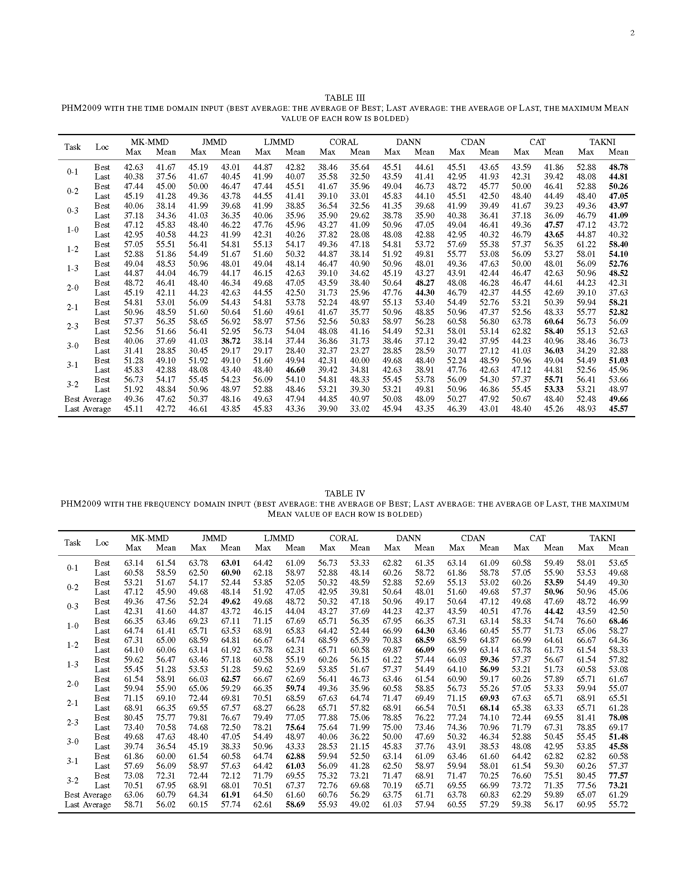
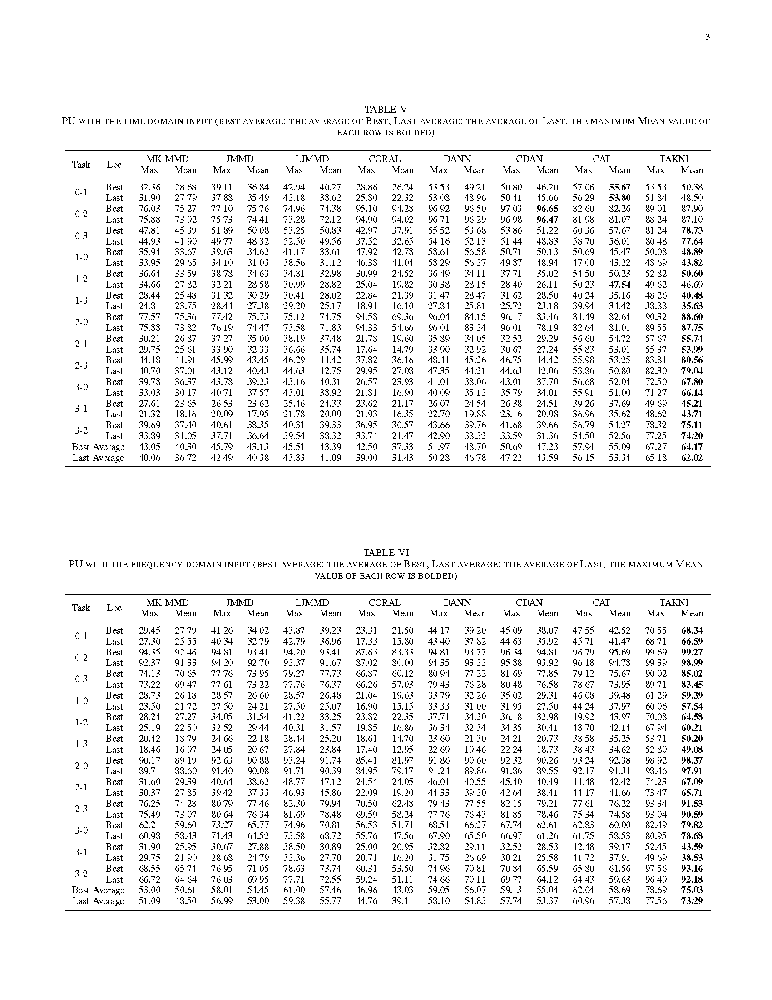
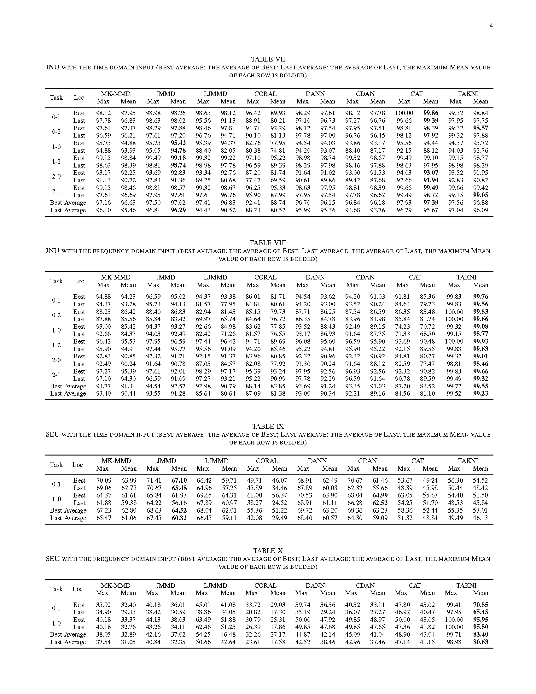

# TAKNI: Temporal Attention-Driven Kernel Norm Integration Network for Fault Diagnosis

## Overview

This repository contains the source code and supplementary materials for the paper titled "TAKNI: Temporal Attention-Driven Kernel Norm Integration Network for Fault Diagnosis".

## Key Contributions

1. Introduction of a TAM that effectively captures long-term dependencies in time-series data, achieving better feature extraction and significantly improving the accuracy of cross-domain diagnosis.

2. Proposal of a MSKWM, which addresses the issue of majority class bias, enhances the discriminative ability for minority class samples, and reduces the risk of misclassification.

3. Design of the TAKNI algorithm by integrating TAM and MSKWM, achieving state-of-the-art performance on five publicly available fault diagnosis datasets and demonstrating its effectiveness and generalization capability in various cross-domain fault diagnosis tasks.

## Results Summary

The TAKNI model demonstrates exceptional performance across multiple datasets in transfer learning tasks. Its average performance on various datasets:

- **CWRU dataset**: Best time-domain model achieves 99.68%, best frequency-domain model reaches 100%
- **PHM2009 dataset**: Best time-domain model achieves 49.66%, best frequency-domain model reaches 61.29%
- **JNU dataset**: Best time-domain model achieves 96.88%, best frequency-domain model reaches 99.55%
- **PU dataset**: Best time-domain model achieves 64.17%, best frequency-domain model achieves 75.03%
- **SEU dataset**: Best time-domain model achieves 53.01%, best frequency-domain model reaches 83.40%

Detailed experimental results are available in the TAKNI_results.pdf file included in this repository.

## TAKNI_results.pdf Content Preview

The TAKNI_results.pdf file contains comprehensive experimental results from the paper, including:

- Performance comparisons across different datasets (CWRU, JNU, PHM2009, PU, and SEU)
- Radar charts showing mean accuracy of the best models for each method
- Visualizations comparing time-domain and frequency-domain tasks
- Ablation studies demonstrating the impact of removing the MSKWM and TAM modules
- Confusion matrices for classification results across different bearing fault datasets
- T-SNE visualizations of classification results across different bearing fault datasets
- Detailed tables showing results from ablation studies on each dataset

## Visual Results






## Repository Structure

```
TAKNI/
├── Diffusion/                 # Diffusion model components
├── DiffusionFreeGuidence/     # Conditional diffusion model components
├── bottlenecks/              # Bottleneck layers implementation
├── dataset/                  # Dataset loaders and utilities
├── dataset_diffusion/        # Diffusion-specific dataset processing
├── datasets/                 # Various dataset implementations
├── loss/                     # Loss function implementations
├── models/                   # Model architectures
├── transcal/                 # Transfer calibration components
├── utils/                    # Utility functions
├── optim/                    # Optimization algorithms
├── Main_Diffusion.py         # Main entry point for diffusion models
├── Scheduler.py              # Training schedulers
├── train_*.py                # Training scripts
├── *.sh                      # Shell scripts for running experiments
├── assets/                   # Image assets
└── TAKNI_results.pdf         # Detailed experimental results
```

## Requirements

The project is built using Python and PyTorch. Specific dependencies are documented in the paper and implementation.

## Usage

See the individual script files and shell scripts for running the experiments described in the paper.

## Acknowledgments

We thank the contributors and institutions that made the datasets used in our experiments publicly available.